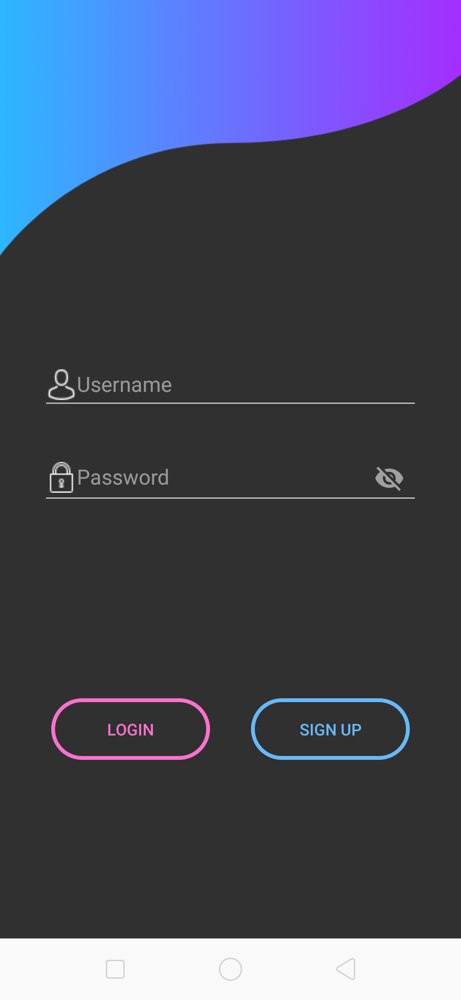
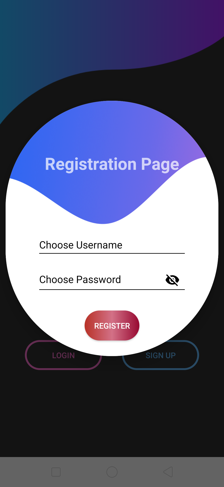
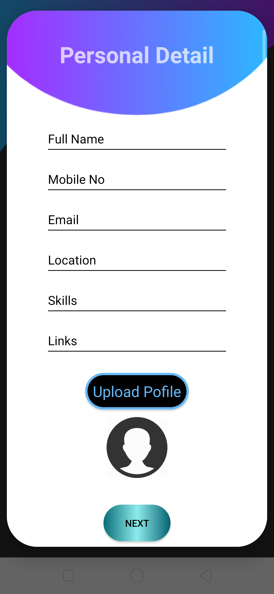
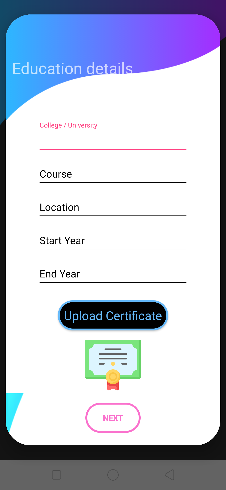
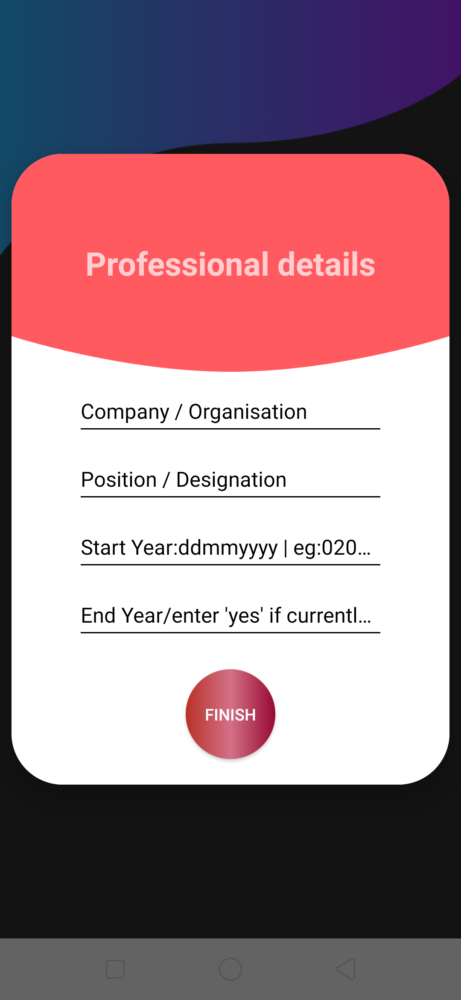
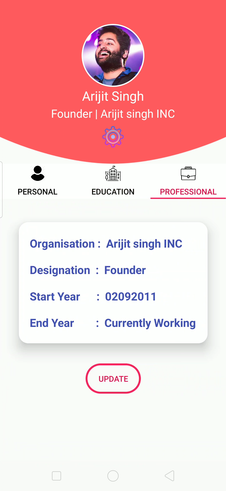
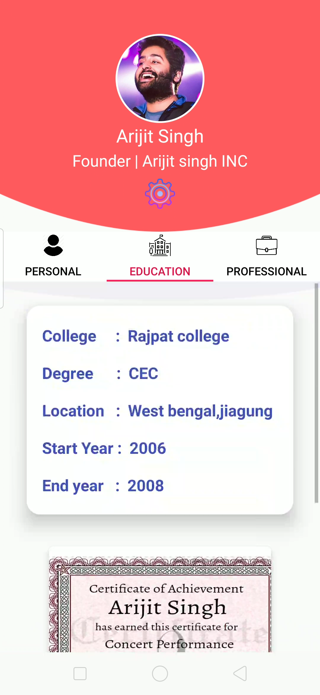
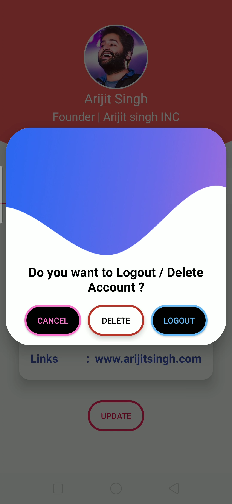

Hello Everyone this is my second repo I have developed an android app As my intern project for The spark Foundation.

Material Design  Login | SignUp | User Detail Registration using Volley Http Library Android [ POST,PUT,GET,DELETE ] . 
Contain:
 --- Material design Login Activity
--- Material design signUp Alert Dialog 
--- material Design Personal Detail,Education Detail,Professional Detail Alert Dialogs
 ---- Material Design TabLayout with Customised Detail in App bar Layout 
---  Tabs Containing Fragments to deal with POST,PUT,GET,DELETE Operation 
      Visit my youtube channel for Output video:  </a> 
      (https://www.youtube.com/watch?v=3KXWYLMDWug)
       
  
    
  
    
  
    
  
    

      
